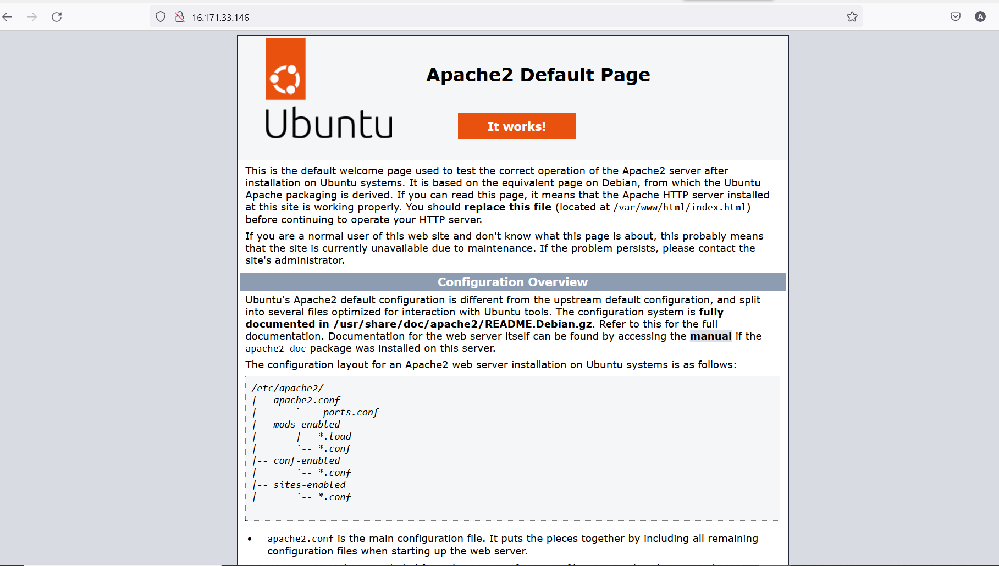
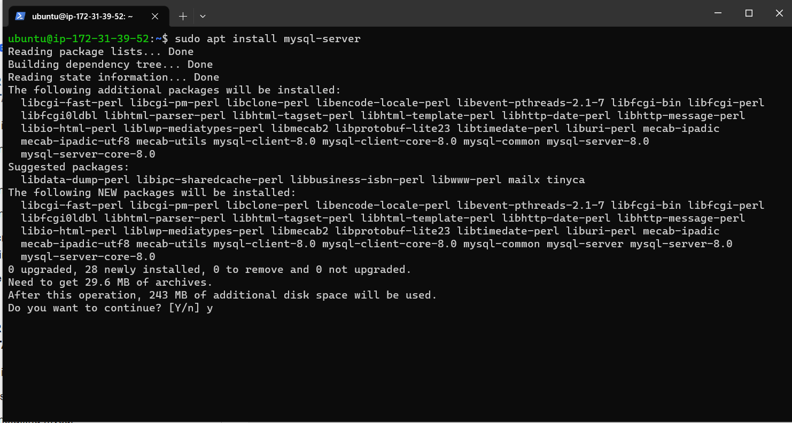
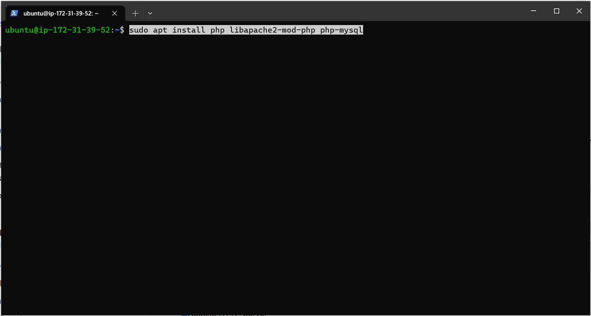

## Documentation for Project 1

# STEP 1 — INSTALLING APACHE AND UPDATING THE FIREWALL

`sudo apt update`

`sudo apt upgrade`

*install apache2 package*

`sudo apt install apache2`


*run the command below to verify that apache2 is running*


*Ensure port 80 is allowed on our security group on the EC2 instance*


*check if the web browser is running by*

*http://<Public-IP-Address>:80*




# STEP 2 — INSTALLING MYSQL

*after the web server is up next is to install the database management system*

`sudo apt install mysql-server`



*log into the MYSQL console*

`sudo mysql`


*start the interactive by running*

`sudo mysql_secure_installation`

*This will ask if you want to configure the VALIDATE PASSWORD PLUGIN done in the image below*


# STEP 3 — INSTALLING PHP

*PHP is the component of our setup that will process code to display dynamic content to the end user. In addition to the php package, hence we will be installing the full package*

`sudo apt install php libapache2-mod-php php-mysql`



*we can then check to see the version of our running PHP*

`php -v`


# STEP 4 — CREATING A VIRTUAL HOST FOR YOUR WEBSITE USING APACHE

*make a directory called project lamp*

`sudo mkdir /var/www/projectlamp`

*assign ownership to directory in this case we will use USER*

`sudo chown -R $USER:$USER /var/www/projectlamp`

*we need to create and open a new configuration in the Apaches file*

`sudo vi /etc/apache2/sites-available/projectlamp.conf`


*the below bare-bones configuration are pasted in the opened  editor of the file*

```
<VirtualHost *:80>
    ServerName projectlamp
    ServerAlias www.projectlamp 
    ServerAdmin webmaster@localhost
    DocumentRoot /var/www/projectlamp
    ErrorLog ${APACHE_LOG_DIR}/error.log
    CustomLog ${APACHE_LOG_DIR}/access.log combined
</VirtualHost>
```


`sudo ls /etc/apache2/sites-available`

*use the above command to see the new sites-avalable*


*next is to anable the new virtual host*

`sudo a2ensite projectlamp`
`sudo a2dissite 000-default`
`sudo apache2ctl configtest`
`sudo systemctl reload apache2`


*from the above the website is now active, however the web root /var/www/projectlamp is still empty. Hence we will be Creating an index.html file in that location so that we can test that the virtual host works as expected*

`sudo echo 'Hello LAMP from hostname' $(curl -s http://169.254.169.254/latest/meta-data/public-hostname) 'with public IP' $(curl -s http://169.254.169.254/latest/meta-data/public-ipv4) > /var/www/projectlamp/index.html`


*check the browser with http://public-ip:80*


# STEP 5 — ENABLE PHP ON THE WEBSITE

*With the default DirectoryIndex settings on Apache, a file named index.html will always take precedence over an index.php file. To change this behavior, you’ll need to edit the /etc/apache2/mods-enabled/dir.conf file and change the order in which the index.php file is listed within the DirectoryIndex directive*

`sudo vim /etc/apache2/mods-enabled/dir.conf`

*replace " DirectoryIndex index.html index.cgi index.pl index.php index.xhtml index.htm " with the line "DirectoryIndex index.php index.html index.cgi index.pl index.xhtml index.htm"*

`sudo systemctl reload apache2`


*Finally, we will create a PHP script to test that PHP is correctly installed and configured on your server*

*we will finally create a PHP script to test that PHP is correctly installed and configured on your server,by creating a new file named inde.php*

`vim /var/www/projectlamp/index.php`


*refresh the web browser and you should see the below*


